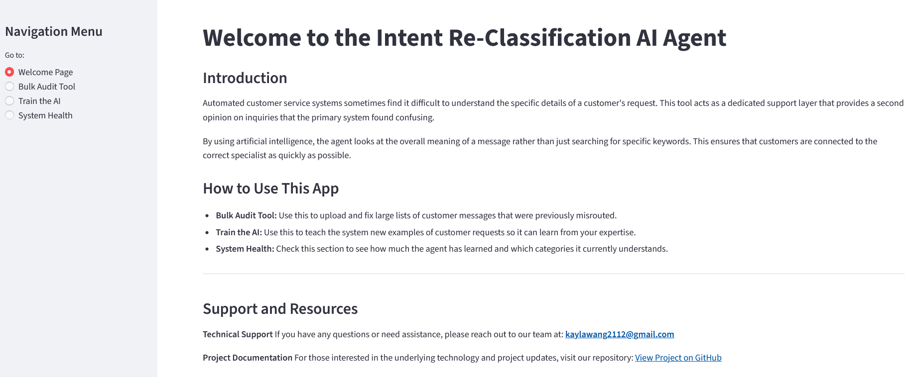
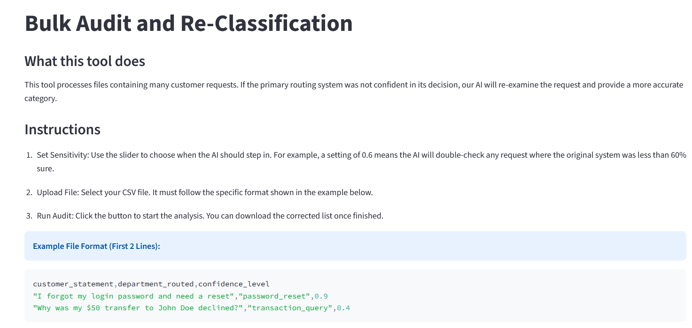
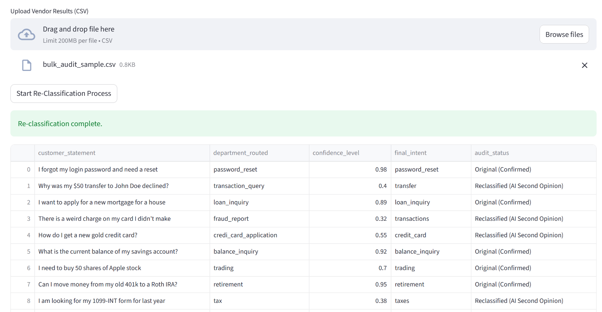
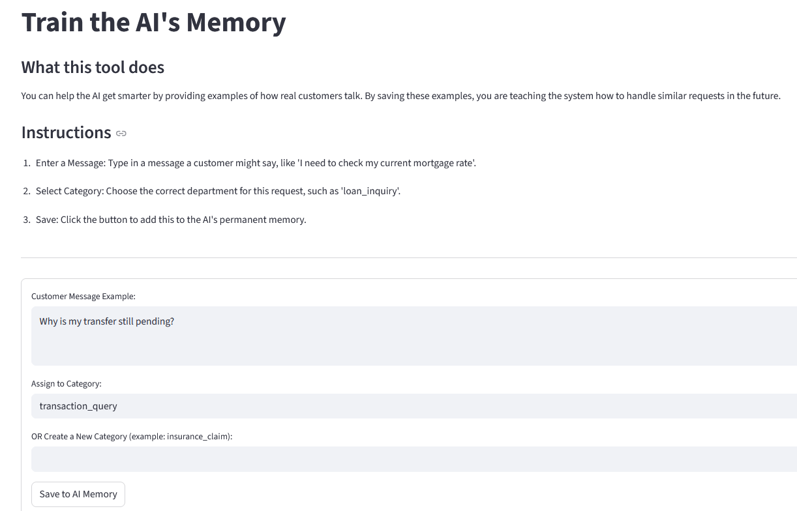
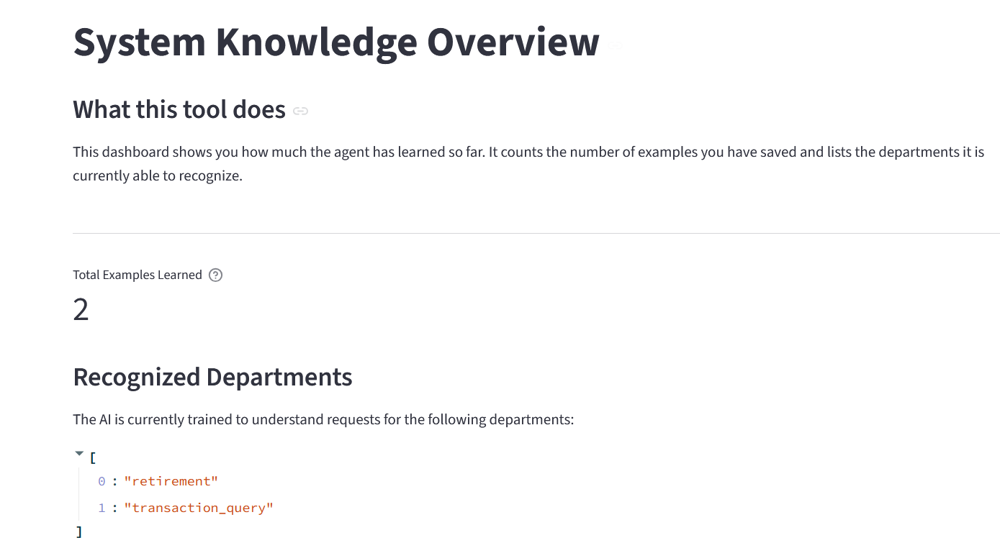

# Customer Intent Re-Classification AI Agent

### Project Overview

The **Customer Intent Re-Classification AI Agent** is a sophisticated logic-recovery tool designed for financial institutions, such as **Fidelity Investments**, that utilize third-party vendor models for automated customer inquiry routing. In large-scale financial environments, these external models can struggle with specialized jargon or subtle nuances, leading to low-confidence predictions and misrouted requests.

This application functions as a **Semantic "Second Opinion" layer**. It identifies inquiries with low confidence scores and reapplies high-precision intelligence using a local **Retrieval-Augmented Generation (RAG)** pipeline. By comparing new queries against a "Semantic Memory" of successful historical cases, the agent ensures that every customer is connected to the correct specialist department while maintaining strict data privacy.

**The app is available at https://projects-kdm66x2y9apc5fjzxbtff5.streamlit.app/**

*Note: This application requires a local Ollama instance. Cloud deployment is for UI demonstration only - the Bulk Audit Tool therefore returns only "mock_mode_label" for queries below the user-defined confidence level.*

---

### Visual Preview

#### 1. Welcome & Support Interface


#### 2. Bulk Audit & AI Re-Classification



#### 3. Semantic Memory Trainer


#### 4. System Knowledge Overview


---

### Key Features

* **Semantic "Second Opinion" Logic:** Automatically intercepts data with low confidence scores and uses a local Llama-3 model to re-evaluate the intent based on meaning rather than just keywords.
* **Bulk Audit & Re-Classification:** Allows representatives to upload large datasets (CSV) and batch-process thousands of records to fix routing errors.
* **Dynamic Memory Training:** A user-friendly interface for human agents to "teach" the AI by injecting new, high-quality examples into the vector database without changing the code.
* **Adjustable Intervention Thresholds:** Enables users to interactively set the exact confidence level (e.g., 0.5 or 0.6) at which the AI agent should take over.
* **Irrelevant Intent Filtering:** Protects specialized service desks by identifying and isolating non-financial "noise" or irrelevant queries.
* **Standardized Output Logic:** Automatically formats all intent labels into a consistent `lowercase_snake_case` format required for enterprise financial systems.

---

### Technical Stack

* **Language:** Python 3.x
* **Interface:** Streamlit (Web UI)
* **Intelligence Engine:** LangChain (RAG Orchestration) and Llama-3 (Local LLM via Ollama)
* **Vector Database:** ChromaDB (Local Persistent Memory)
* **Data Handling:** Pandas (Dataframe processing)
* **Embeddings:** HuggingFace (sentence-transformers/all-MiniLM-L6-v2)

---

### Installation & Local Usage

1. **Clone the repository:**
```bash
git clone https://github.com/kayla-dsrepo/Projects
cd your-repo-name

```


2. **Ensure Ollama is running Llama-3 locally:**
```bash
ollama run llama3

```


3. **Install dependencies:**
```bash
pip install streamlit pandas langchain-community langchain-huggingface chromadb ollama

```


4. **Launch the application:**
```bash
streamlit run Financial_Customer_Intent_AI_Agent.py

```


---

### Project Context & Disclaimer

This project was developed to demonstrate technical proficiency in building AI-driven financial logic recovery systems.

**Note on Enterprise Deployment:** I recognize that in a production environment (such as at Fidelity Investments), an application of this nature would require enterprise-grade security (PII masking), high-scale data processing (Spark/Distributed computing), and integration into secure internal cloud infrastructures rather than a local Streamlit deployment.

---

